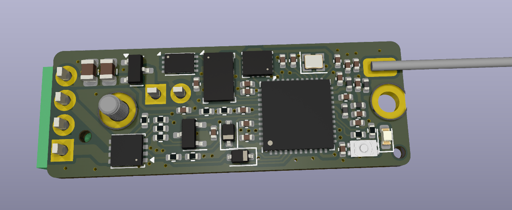

# The Apus Flight Computer (Work in progress and untested!)

Just a smol board for rockets.

Basically the [rocketbeacon](https://github.com/ElvinC/rocketbeacon) with added deployment channels and sensors.

Rev. 1.0 has the following hardware:

* STM32WLE5 MCU Built-in sub-GHz transceiver (for telemetry or RDF) tuned for the 440MHz band
* 2x pyro deployment channels with continuity detection
* 16Mbit flash (W25Q16JVUXIQ)
* BMI270 IMU
* MS5607 Barometer
* Reverse voltage protection
* 13x36mm board size with 2x M2 mounting holes
